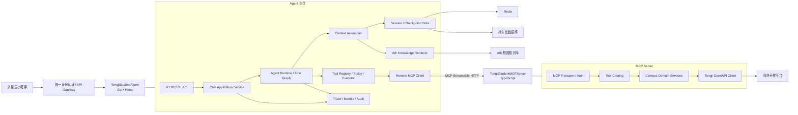
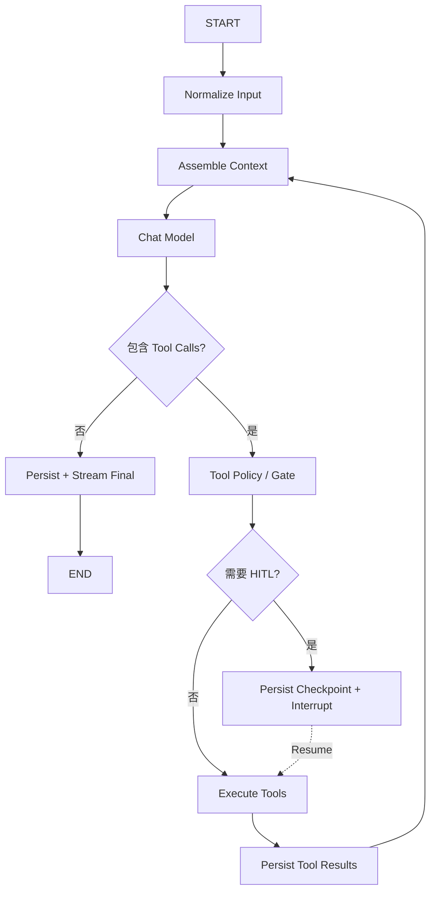
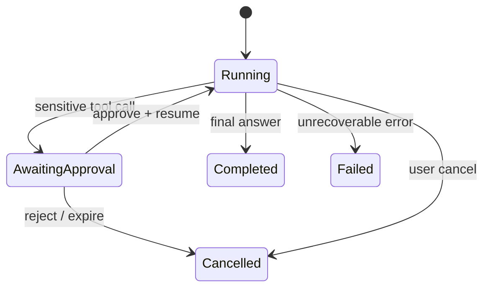

# TongjiStudent Agent 技术方案与实施路线

> 文档状态：方案基线<br>
> 更新时间：2026-07-19<br>
> 适用仓库：`TongjiStudentAgent`（Go）与 `TongjiStudentMCPServer`（TypeScript）<br>
> 产品目标：在 2026 年 9 月新生入学前，交付一个可验证、可追踪、可持续扩展的校园问答与服务型 Agent。

## 1. 结论与实施顺序

当前 `TongjiStudentAgent` 已经能够启动 Hertz、调用模型、连接进程内 MCP demo，并可选检索 Ark 知识库，但它仍是演示基架：没有受控的 Agent Loop、会话级短期记忆、远程 MCP、统一工具执行策略、流式事件协议、HITL、评测闭环和生产级安全边界。

本项目不应直接复制 `reference` 的完整架构。`reference` 已经服务于复杂的多 Agent、Skill、沙箱、任务队列和多种业务形态，成熟度高，也带有大量当前产品用不到的工程复杂度。我们应复用它最重要的设计原则：

1. 将 Agent 核心编排与基础设施适配分开。
2. 将单轮推理图与请求生命周期分开。
3. 让上下文装配成为独立、可测试的模块。
4. 原始会话消息只追加，摘要是可重建的派生状态。
5. 工具先发现、校验和授权，再执行；工具失败必须回到受控 Loop。
6. HITL 依赖持久化检查点，不能只靠前端弹窗。
7. 所有输出都通过统一事件流对外暴露，日志、指标和追踪围绕一次 Run 建立。

实施顺序必须固定为：

1. **安全与协议基线**：移除本地文件和 Shell 能力，定义身份、会话、事件、错误和两仓边界。
2. **单 Agent Runtime**：用 Eino Graph 建立可控的 Model → Tool → Model Loop，并实现流式输出、超时、取消和迭代上限。
3. **短期记忆与上下文工程**：引入 Session、History、Summary、Token Budget 和上下文装配器。
4. **远程 MCP 最小闭环**：独立部署 TypeScript MCP Server，先打通一个只读工具，再扩展工具目录。
5. **知识库与产品 P0**：把校园 FAQ、来源、身份适用范围、页面跳转和反馈纳入稳定回答协议。
6. **HITL 与高风险能力**：只在需要写操作或敏感确认时引入 Checkpoint/Resume；首期只读工具不为 HITL 阻塞。
7. **Skill 与复合任务**：在工具和 Loop 稳定后，再沉淀“查课表”“毕业要求核对”等场景 Skill。
8. **评测、灰度和运营闭环**：离线用例、线上指标、安全审计和知识更新机制全部达标后上线。

前四步是所有后续能力的地基。没有完成远程 MCP 单工具闭环前，不应批量封装 225 个开放平台接口；没有稳定 Session 和 Checkpoint 前，不应实现 HITL；没有可观测的工具调用闭环前，不应引入多 Agent。

## 2. 当前事实与问题边界

### 2.1 当前已实现

以源码为准，主仓当前具备：

- Hertz HTTP 服务与健康检查。
- `POST /v1/agent/chat` 单轮非流式接口。
- Ark ChatModel 初始化。
- Eino `deep.New` 预构建 DeepAgent。
- 进程内 MCP Client 与 `get_current_time` demo 工具。
- 可选 Ark 知识库检索，并将检索文本拼入用户消息。
- 可选 Fornax 回调。

当前调用链为：

```text
HTTP /v1/agent/chat
  -> biz/handler.Chat
  -> agent.Chat
  -> 可选 Ark Knowledge Search
  -> Eino DeepAgent Runner
  -> 进程内 MCP demo
  -> 聚合最终文本
```

### 2.2 当前未实现或不满足生产要求

| 能力 | 现状 | 影响 |
| --- | --- | --- |
| Agent 编排 | 依赖 `deep.New` 默认行为，项目没有自己的 Graph 和节点契约 | 无法精确控制 Loop、持久化、事件和错误恢复 |
| 上下文工程 | 只把知识切片拼入当前问题 | 没有身份、历史、摘要、来源和动态提醒的稳定装配顺序 |
| 短期记忆 | 请求不带 `session_id`，Runner 没有 CheckPointStore | 多轮对话无法延续 |
| MCP | 进程内 demo，仅有时间工具 | 与独立的 `TongjiStudentMCPServer` 部署目标不符 |
| 工具治理 | 没有工具风险等级、参数预检、超时和失败策略 | 无法安全接入学生隐私和未来写操作 |
| HITL | 未实现 | 无法确认高风险操作，也无法中断后恢复 |
| 流式协议 | HTTP 只返回最终 JSON | 前端无法显示思考状态、工具进度和确认请求 |
| 身份与鉴权 | Chat 接口无认证授权 | 不能安全访问课表、成绩等个人数据 |
| 安全 | DeepAgent 挂载本地文件和 `/bin/sh` | 暴露后可能读 `.env`、写文件或执行命令 |
| 隐私 | 日志记录完整 Header、Body、回复和 Agent Message | 可能泄露 Token、成绩、课表和个人信息 |
| 评测 | 只有局部单测 | 无法证明回答准确性、工具选择和来源完整性 |

### 2.3 两个仓库的确定边界

工作区有两个独立仓库，必须保持独立构建、独立发布和独立扩缩容：

| 仓库 | 技术栈 | 职责 |
| --- | --- | --- |
| `TongjiStudentAgent` | Go、Hertz、Eino | 用户入口、身份上下文、Agent 编排、Session、上下文工程、知识检索、MCP Client、工具策略、HITL、事件流和观测 |
| `TongjiStudentMCPServer` | TypeScript、官方 MCP SDK | 远程 MCP Server、同济开放平台适配、工具 Schema、参数校验、领域聚合、上游错误归一、数据脱敏和审计 |

以下职责不能混放：

- Agent 主仓不得直接调用同济 OpenAPI；所有校园实时/个人数据通过 MCP Server 获取。
- MCP Server 不持有对话历史、不调用主模型、不决定 Agent 编排。
- 用户身份来自受信任网关或济星云，不允许模型从工具参数中自行填写学号冒充他人。
- Ark 知识库属于 Agent 的检索上下文，不放进 MCP Server 首期职责。

## 3. 从 reference 继承什么

### 3.1 `core / adapter / cmd` 的依赖方向

`reference/agentic/harness` 将纯运行时放在 `core`，把 Redis、模型、业务 SDK、事件系统等副作用放在 `adapter`，最终由入口层装配。这个边界非常适合当前项目：Agent Loop 应当能够用内存 History、Fake Model 和 Fake Tool 独立测试，而不需要启动 Hertz、Ark、Redis 或 MCP Server。

在本项目中的映射如下：

| reference 概念 | 本项目落点 |
| --- | --- |
| `harness/core` | `internal/agentic`：Graph、Context Engine、Tool Policy、Session 契约、Run 状态机 |
| `harness/adapter` | `integration/`（迁移期）与后续 `internal/integration`、`internal/store`：Ark、Knowledge、MCP、Sandbox、Redis、数据库、事件适配 |
| `harness/cmd` | 当前 `main.go` 与后续 `cmd/server` |
| `harness/biz` | `biz/handler` 与 `internal/application` |

依赖方向固定为：

```text
handler/application -> agentic core <- integration/store implementations
                              ^
                              |
                         interface only
```

`internal/agentic` 不能导入 Hertz、具体 Redis Client、具体 MCP Client、Ark SDK 或 Sandbox 实现。它只依赖 Eino 的消息和编排契约，以及项目内部定义的接口。

### 3.2 `Handle` 与 `Run` 分离

reference 的 `Run` 只负责一轮 Graph；`Handle` 负责身份、会话锁、事件流、心跳、取消、追踪、Run/Resume 分流和生命周期。当前项目也需要这两个层次：

- `Runtime.Run/Resume`：纯 Agent Loop。
- `ChatService.Handle`：一次用户请求的完整生命周期。

这样可以避免把 HTTP、SSE、Session 锁和 Trace 写进每个 Graph 节点，也能直接对 Runtime 做确定性测试。

### 3.3 Context Engine

reference 将上下文装配抽为 `Engine.AssembleForTurn`，并用 `History`、`SessionContext`、`Summarizer` 三个接口隔离存储和业务投影。该模式应保留，但首期缩小为：

- `HistoryStore`：追加、读取原始消息。
- `SessionStore`：读取身份快照、摘要、压缩水位和状态。
- `Summarizer`：压缩历史。
- `ContextAssembler`：按固定顺序输出模型消息。

真实消息保持 append-only。摘要只记录“已概括到哪一条消息”，不删除原始消息。这能支持问题复盘、重新摘要、审计和未来的 Session Resume。

### 3.4 Tool Registry、Gate 与 Executor

reference 将工具发现、可用性、权限检查、参数预检和真实执行分开。当前项目也需要：

```text
Tool Catalog -> Tool Registry -> Tool Policy/Gate -> Tool Executor -> MCP Client
```

- Registry 决定模型本轮能看到什么。
- Policy 决定用户是否有权调用、是否需要确认。
- Executor 处理参数校验、身份注入、超时、重试、结果裁剪和事件。
- MCP Client 只负责协议通信。

未知工具或可修正的参数错误应转换成模型可见的 Tool Result，让模型有一次自我修正机会；鉴权失败、越权、系统性错误和达到失败熔断阈值则终止本轮。

### 3.5 Checkpoint 驱动的 HITL

reference 的 HITL 使用 Eino/ADK CheckPointStore：工具执行触发中断，Graph 保存检查点，用户提交表单后从原节点 Resume。这个语义需要保留。仅保存一个“等待确认”数据库字段不足以恢复 Tool Call、Graph State 和剩余迭代次数。

### 3.6 暂不继承的能力

以下能力在 reference 中有价值，但不进入首期关键路径：

- 多 Agent 控制面和子 Agent 通信。
- Busy Queue、Session Inbox 和复杂跨节点 Drain。
- 本地文件、Shell、Sandbox 和 Artifact。
- 长期记忆提取、偏好画像和跨会话记忆。
- 动态 Skill 市场与复杂渐进加载。
- Todo、任务规划和后台长任务。

这些能力只有在明确产品场景出现后才加入。首期校园问答的核心是“可信回答 + 正确工具 + 身份安全 + 来源可追踪”。

## 4. 目标系统架构



### 4.1 知识与工具的分工

| 数据类型 | 使用方式 | 示例 |
| --- | --- | --- |
| 官方但变化较慢的公开信息 | Ark 知识库检索 | 报到材料、校园卡办理、VPN 指南、图书馆规则 |
| 实时或个人数据 | MCP Tool | 当天课表、个人成绩、校园卡余额、宿舍电量 |
| 确定性跨接口计算 | MCP 领域工具 | 培养计划与已修学分对照、毕业要求差距分析 |
| 可办理动作 | MCP Tool + Agent HITL | 日程创建、联系方式修改等未来写操作 |

知识库回答必须携带来源标题、来源 URL、发布时间或核验时间。工具结果必须携带数据时间、适用身份和必要的业务来源。模型只负责组织答案，不能凭空生成来源。

## 5. Agent 主仓设计

### 5.1 建议目录

在不一次性大搬迁当前代码的前提下，新增能力按以下边界落位；旧的 `agent/`、`biz/handler/` 可逐步成为适配层，避免大爆炸式重构。

```text
TongjiStudentAgent/
├── cmd/server/                         # 可在后续迁移 main.go
├── biz/handler/                        # HTTP/SSE 参数与响应适配
├── internal/application/chat/          # Handle 生命周期、Run/Resume/Cancel
├── internal/agentic/
│   ├── runtime/                        # Agent、Graph、Run 状态
│   ├── stage/                          # input/context/model/tool/output 节点
│   ├── context/                        # 上下文装配与 Token Budget
│   ├── session/                        # Session/History/Checkpoint 契约
│   ├── tool/                           # Registry、Policy、Executor、错误分类
│   ├── event/                          # 内部事件模型
│   └── skill/                          # 后续 Skill manifest/loader
├── internal/integration/
│   ├── arkmodel/                       # Ark 模型适配
│   ├── knowledge/                      # Ark 知识库适配
│   └── mcp/                            # 远程 MCP Client 适配
├── integration/sandbox/                # 迁移期 Sandbox Adapter；不属于 Agent Runtime
├── internal/store/
│   ├── memory/                         # 开发与测试实现
│   ├── redis/                          # Session、锁、Checkpoint
│   └── database/                       # 原始消息、反馈、审计
├── internal/platform/
│   ├── auth/                           # 可信用户身份
│   ├── config/                         # 配置解析与启动校验
│   ├── observability/                  # trace/metrics/logging
│   └── privacy/                        # 脱敏与日志策略
└── docs/
```

首个实现 PR 不需要把全部目录一次建完。每个阶段只增加该阶段真正使用的包。

### 5.2 统一配置对象

当前全局变量 `deepAgent`、`mcpClient`、`knowledgeClient` 应逐步收敛到显式依赖：

```go
type RuntimeConfig struct {
    Name              string
    Model             Model
    FallbackModel     Model
    PromptProvider    PromptProvider
    ContextFactory    ContextFactory
    ToolProvider      ToolProvider
    CheckpointStore   CheckpointStore
    EventSink         EventSink
    Tracer            Tracer
    MaxIterations     int
    ModelTimeout      time.Duration
    ToolTimeout       time.Duration
    TokenLimit        int
    EnableHITL        bool
}
```

要求：

- 构造时校验必填项，服务启动后不因首个请求才发现配置缺失。
- `internal/agentic` 只认识接口。
- 环境变量只在配置层读取，不能散落在 Graph 节点和 Tool Executor 中。
- 默认值必须保守：HITL 关闭、写工具关闭、最大迭代有限、日志不记录内容。

### 5.3 单 Agent Graph 与 Loop

首期采用显式 Eino Graph，替代项目对 `deep.New` 隐式编排的依赖：



节点职责：

1. `NormalizeInput`：校验用户输入、建立可信身份上下文、标准化语言和附件引用。
2. `AssembleContext`：读取会话、检索知识、控制 Token、生成模型消息。
3. `ChatModel`：绑定本轮允许的工具，流式调用主模型；必要时调用 Fallback。
4. `ToolPolicy`：检查工具存在性、风险等级、用户权限、参数 Schema 和 HITL 要求。
5. `ExecuteTools`：逐个执行。首期默认串行，确保结果顺序和副作用可控。
6. `PersistToolResults`：保存与 Tool Call ID 配对的结果，再进入下一轮模型调用。
7. `Output`：只在没有 Tool Call 时发最终答案，保存 Assistant 消息并结束。

Loop 的硬边界：

- `MaxIterations` 首期建议 12；复杂复合 Skill 可单独提高，禁止使用 500 作为默认值。
- 模型单次调用、工具单次调用和整轮 Run 都有独立超时。
- 同一种工具连续失败达到阈值后，允许模型生成一次自然语言收尾，然后终止。
- Tool Call 与 Tool Result 必须严格按 `tool_call_id` 配对。
- 同一 Assistant 消息中的工具首期串行执行；确认工具无副作用且调用链独立后再开放并行。
- 用户取消应传播到模型请求和 MCP 调用。

### 5.4 请求生命周期

`ChatService.Handle` 负责：

1. 从网关注入信息解析 `UserIdentity`。
2. 创建或加载 Session。
3. 获取同一 Session 的单活跃 Run 锁；首期 busy 时直接返回冲突，不实现队列。
4. 创建 `run_id`、Trace 和事件流。
5. 根据请求类型调用 `Runtime.Run` 或 `Runtime.Resume`。
6. 推送心跳、工具状态、HITL 和最终消息。
7. 在成功、失败、取消或 Panic 时统一收尾并释放锁。

首期采用“同一 Session 同时只跑一个 Run”。reference 的 Session Inbox/Busy Queue 在产品出现明确的排队需求后再实现。

### 5.5 对外接口与事件流

保留现有 `POST /v1/agent/chat` 作为兼容接口，仅用于开发和迁移；新增正式接口：

| 方法 | 路径 | 用途 |
| --- | --- | --- |
| `POST` | `/v1/sessions` | 创建会话，返回 `session_id` |
| `POST` | `/v1/sessions/:session_id/messages` | 提交消息并返回 SSE 事件流 |
| `POST` | `/v1/runs/:run_id/resume` | 提交 HITL 确认并恢复 |
| `POST` | `/v1/runs/:run_id/cancel` | 取消当前 Run |
| `POST` | `/v1/messages/:message_id/feedback` | 提交未解决/不准确反馈 |
| `GET` | `/v1/sessions/:session_id/messages` | 分页读取历史消息 |

SSE 事件使用稳定的业务协议，不直接暴露 Eino 内部结构：

```text
run.started
assistant.status
assistant.delta
tool.started
tool.completed
tool.failed
hitl.required
run.completed
run.failed
run.cancelled
```

每个事件至少包含：`event_id`、`run_id`、`session_id`、`timestamp`、`type`。工具事件对用户只显示安全摘要，不返回凭据、原始 Header 或完整个人数据。

兼容接口在正式接口稳定后内部复用同一 `ChatService`，聚合事件为最终 JSON；不能继续保留一条独立 Agent 调用链。

## 6. 上下文工程与短期记忆

### 6.1 上下文装配顺序

模型每轮看到的上下文按以下顺序组装：

1. 稳定 System Prompt：角色、能力边界、安全规则、回答格式。
2. 稳定身份上下文：学生类型、学院、校区、语言；只放业务必需字段。
3. 可用工具说明：由模型原生 Tool Schema 注入，不重复拼入文本 Prompt。
4. 会话摘要：较早历史的累积 Summary。
5. 最近原始消息：User、Assistant、Tool 事务完整保留。
6. 本轮知识库结果：标题、内容摘要、来源、时间和可信度标签。
7. 当前用户消息。
8. 动态提醒：来源展示、身份适用范围、禁止编造等短提示。

稳定内容尽量放在前缀，动态内容放在尾部，以提高模型侧 Prompt Cache 命中率。知识库内容视为非可信数据，只能作为回答依据，不能改变工具策略或系统指令。

### 6.2 Context Assembler 契约

```go
type ContextAssembler interface {
    AssembleForTurn(ctx context.Context, input TurnInput) ([]*schema.Message, error)
}

type TurnInput struct {
    SessionID   string
    UserMessage *schema.Message
    Identity    UserIdentity
    Knowledge   []KnowledgeChunk
}
```

实现要求：

- `UserMessage` 在装配开始时只追加一次。
- Context Assembler 不修改从 History 读取到的原消息；需要适配时复制。
- Assistant Tool Call 与 Tool Result 不允许被摘要切点拆开。
- 检索结果为空时正常降级，不影响基础模型回答。
- 知识库超时默认降级并记录指标；不应让一次 FAQ 检索故障导致所有对话返回 500。
- 超过硬 Token Limit 时返回明确错误，禁止静默删除当前问题或最近工具结果。

### 6.3 Session 数据模型

```text
Session
  session_id
  user_key
  status
  created_at / updated_at
  profile_snapshot        # 本研、学院、校区等最小身份投影
  summary                 # 历史摘要
  summary_anchor          # 摘要覆盖到的消息位置
  version                 # 乐观锁/CAS

Message
  message_id
  session_id
  sequence
  role                    # user / assistant / tool
  content
  tool_calls
  tool_call_id
  metadata                # 来源、数据时间、模型、错误分类
  created_at

Run
  run_id
  session_id
  status                  # running / awaiting_approval / completed / failed / cancelled
  checkpoint_id
  started_at / finished_at
  error_code
```

### 6.4 存储策略

实现分两步：

1. 先定义接口并提供内存实现，用于 Graph 单测和本地开发。
2. 灰度前完成 Redis + 持久化数据库实现。

建议职责：

- Redis：Session Snapshot、短期 History 窗口、同 Session 锁、Run 取消位、HITL Checkpoint。
- 数据库：完整原始消息、Session 元数据、反馈、工具审计；具体数据库选型服从部署平台现有能力。
- 进程内缓存：只做短 TTL 读取优化，不能成为唯一事实源。

所有 Session 写入使用 `session_id + version` 做并发保护。原始消息 append-only；摘要和 Anchor 可覆盖更新。跨实例恢复时，任何 Pod 都应能通过 Redis/数据库加载同一 Session。

### 6.5 Token Budget 与摘要

Token 预算至少分为：

```text
模型上下文上限
  - 固定安全余量
  - 最大模型输出预算
  - Tool Schema 预算
  = 本轮可用消息预算
```

达到软阈值时：

1. 保留当前用户消息。
2. 保留最近若干完整对话轮次。
3. 找到不会拆断 Tool 事务的压缩切点。
4. 将旧 Summary 与新增历史 Delta 一起交给 Summarizer。
5. 更新 `summary + summary_anchor`，原始消息不删除。
6. 重新装配并计算 Token。

摘要连续失败应有熔断，避免每轮重复消耗模型调用。仍超过硬上限时返回可识别的 `CONTEXT_TOO_LONG`，由产品提示用户新建会话；首期不实现复杂的工具结果外溢与按需分页。

## 7. MCP Server 与工具体系

### 7.1 传输与版本选择

两个仓库独立部署，因此使用 MCP Streamable HTTP，端点统一为 `/mcp`。不使用 `stdio`，也不把 TypeScript Server 作为 Go 进程的子进程启动。

截至 2026-07-19，官方 TypeScript SDK 仓库说明 v2 仍处于 pre-alpha，并建议生产继续使用 v1.x。因此首期固定在官方 v1.x 的已发布稳定版本，锁定 lockfile；v2 稳定后单独做升级评估，不能跟随 `main` 分支开发版本。远程部署采用官方推荐的 Streamable HTTP；旧 HTTP+SSE 只作为兼容协议，不作为新系统目标。参考：

- [MCP TypeScript SDK](https://github.com/modelcontextprotocol/typescript-sdk)
- [MCP Streamable HTTP Transport](https://modelcontextprotocol.io/specification/2025-11-25/basic/transports)

首期 MCP Server 使用无会话业务状态的模式：每次 Tool Call 的业务结果只依赖调用参数和可信身份，MCP Server 不保存 Agent 对话状态。这样可以水平扩容，Agent Session 仍由主仓维护。

### 7.2 MCP Server 建议目录

`TongjiStudentMCPServer` 当前只有空 README，可从以下最小结构开始：

```text
TongjiStudentMCPServer/
├── src/
│   ├── index.ts
│   ├── config/
│   ├── transport/
│   │   ├── http.ts
│   │   └── auth.ts
│   ├── tools/
│   │   ├── registry.ts
│   │   ├── schedule/
│   │   ├── score/
│   │   ├── shuttle/
│   │   └── graduation/
│   ├── domain/
│   │   ├── schedule-service.ts
│   │   ├── score-service.ts
│   │   └── graduation-service.ts
│   ├── integration/tongji-openapi/
│   │   ├── client.ts
│   │   ├── auth.ts
│   │   ├── generated-types.ts
│   │   └── errors.ts
│   ├── observability/
│   └── privacy/
├── test/
├── package.json
├── tsconfig.json
└── README.md
```

TypeScript 打开严格模式。输入 Schema 使用 SDK 兼容的 Zod 版本，工具输出同时提供结构化数据和精简文本，避免 Agent 再解析自由文本。

### 7.3 工具设计原则

不要把 225 个 OpenAPI Endpoint 一对一暴露为 225 个 Tool。模型更适合调用任务级、边界清晰的领域工具：

| Tool | 领域含义 | 可能聚合的开放平台接口 |
| --- | --- | --- |
| `campus.schedule.get_today` | 查询当前用户今天课程 | 学生课表、当前学期、校历 |
| `campus.schedule.get_term` | 查询指定学期课表 | 本研课表、学期日历 |
| `campus.score.list` | 查询当前用户成绩 | 本科/研究生成绩、学期编号 |
| `campus.shuttle.search` | 查询校区间班车 | 班车数据源或济星云接口，需后续确认 |
| `campus.graduation.check_progress` | 对照培养计划与已修学分 | 培养计划、计划完成情况、已修/应修学分、成绩 |

工具命名、描述和 Schema 必须满足：

- 名称稳定，使用 `campus.<domain>.<action>`。
- 描述写清适用对象、本研差异、是否实时、返回的数据时间。
- 枚举优先，避免模型自由填写校区、学期等协议值。
- 默认作用于当前认证用户，Schema 中不出现可由模型填写的 `user_id`。
- 管理员代查属于另一套明确授权的工具，不复用学生自查工具。
- 返回结果包含 `status`、`data`、`data_as_of`、`source`、`warnings`、`next_actions`。
- 上游空数据与系统错误分开；“本学期暂无成绩”不能返回成 500。
- 输出只包含回答所需字段，禁止把 OpenAPI 完整响应透传给模型。

### 7.4 身份传递与服务间认证

可信身份链路：

```text
济星云登录态
  -> Gateway 验证
  -> Agent 获得不可伪造的 UserIdentity
  -> Agent Tool Executor 生成短期下游凭证/签名上下文
  -> MCP Server 验签并取得 subject + scopes
  -> OpenAPI Client 使用服务凭证，并按 subject 查询
```

关键约束：

- 不信任请求 Body 中的 `user_id`、`student_id`、学院和角色。
- 不信任模型生成的身份参数。
- Agent 到 MCP Server 使用服务到服务认证，优先使用平台支持的 mTLS 或短期 JWT；若首期只能用静态 Bearer Token，必须放密钥管理系统、定期轮换并限制网络访问。
- 下游身份凭证设置短 TTL，包含 `sub`、`aud`、`scopes`、`run_id`、`session_id` 和唯一 `jti`。
- MCP Server 按 Tool 校验 Scope，例如 `schedule:read:self`、`score:read:self`。
- 身份 Header 和 OpenAPI 凭据禁止进入 Tool Result、模型上下文和普通日志。

### 7.5 Go MCP Client

主仓当前依赖的 `github.com/mark3labs/mcp-go v0.43.0` 已提供 `client.NewStreamableHttpClient` 和对应的 Streamable HTTP Transport，首个联调 Spike 可以直接复用当前依赖，不需要先替换 Go MCP SDK。正式实现仍应包在项目自己的 `MCPClient` 接口后，避免协议库类型扩散到 Runtime。

主仓的 MCP 适配层负责：

- 连接远程 `/mcp`，初始化并获取服务端能力。
- 启动时拉取 Tool Catalog 并转换为 Eino Tool。
- 对工具名和 Schema 做本地快照，服务端变化需要显式刷新或重启，避免单个 Run 中工具集合漂移。
- 每个 Tool Call 注入当前 Run 的可信身份和 Trace ID。
- 设置连接、请求和整轮超时。
- 对幂等只读调用允许有限网络重试；模型不可见的传输错误最多重试一次。
- 将 MCP 协议错误、业务错误、鉴权错误和超时归一为内部错误类型。
- 服务关闭时释放 MCP Client。

MCP Server 不可用时：

- 公开知识问答仍可降级运行。
- 需要个人数据的请求明确告诉用户“校园数据服务暂时不可用”，不能由模型猜测答案。
- 健康检查区分 Agent 存活与 MCP 依赖就绪：`/health/live` 和 `/health/ready`。

## 8. 工具执行、安全与 HITL

### 8.1 工具风险分级

| 等级 | 类型 | 示例 | 首期策略 |
| --- | --- | --- | --- |
| R0 | 公开只读 | 天气、校历、公开班车 | 可直接执行 |
| R1 | 个人敏感只读 | 课表、成绩、住宿、电量 | 鉴权后执行；前端和日志最小展示 |
| R2 | 可逆写操作 | 创建个人日程、更新草稿 | 必须 HITL 确认 |
| R3 | 高影响或不可逆 | 修改联系方式、支付、发送通知 | 首期禁用；后续双重确认和独立授权 |

风险等级由 Agent 主仓的受控配置决定，不能只相信 MCP Tool Description。MCP Server 也必须做最终授权，形成双层防线。

### 8.2 Tool Executor 流程

```text
模型 Tool Call
  -> 工具是否在本轮 Registry
  -> JSON/Schema 校验与规范化
  -> 身份 Scope 与风险策略
  -> 是否需要 HITL
  -> 超时上下文与审计开始
  -> MCP 调用
  -> 结果 Schema 校验、裁剪和脱敏
  -> 保存 Tool Result
  -> 事件、Trace、指标收尾
```

错误分类：

| 类型 | 是否回给模型修正 | 行为 |
| --- | --- | --- |
| 参数格式/枚举错误 | 是 | 返回安全的 Tool Error，让模型最多修正一次 |
| 空数据 | 是 | 返回成功但 `data=[]`，由模型解释 |
| 上游限流/临时超时 | 是 | 有限重试后返回暂不可用 |
| 未认证/越权 | 否 | 终止工具链，返回标准权限错误 |
| 结果 Schema 不合法 | 否 | 记录服务错误，不能把原始结果交给模型 |
| 连续重复失败 | 否 | 触发熔断，允许模型做一次自然语言收尾 |

### 8.3 HITL 状态机

首期只读产品可先完成接口和状态模型，真正启用从第一个 R2 工具开始：



`hitl.required` 事件需要包含：

- 用户可理解的操作摘要。
- 将读取或修改的数据范围。
- 风险提示。
- 脱敏后的参数预览。
- `approval_id` 和过期时间。

批准记录必须绑定：`user_key + run_id + tool_name + normalized_arguments_hash + expires_at`。恢复时若参数、身份或工具版本变化，原批准失效，禁止“确认 A、执行 B”。拒绝和超时都要向 Graph 写入配对的 Tool Result，再让模型自然结束。

## 9. Skill 与场景编排

Tool 是可执行能力，Skill 是一组场景说明、允许工具和完成条件。首期不要在工具还不稳定时先建设复杂 Skill 系统。

建议在第五阶段后引入最小 Skill Manifest：

```yaml
name: get-today-schedule
description: 查询当前学生今天的课程并按时间排序
applicable_to:
  - undergraduate
  - postgraduate
allowed_tools:
  - campus.schedule.get_today
instructions: |
  先确认日期和校区；展示课程名、时间、教室、教师。
  无课时明确说明，不推测调课信息。
completion:
  required_fields:
    - data_as_of
    - source
```

加载策略：

1. System Prompt 只放 Skill 名称与一句描述。
2. 模型选择 Skill 后再加载完整说明和允许工具。
3. 允许工具必须收窄，不能因加载 Skill 扩大用户权限。
4. Skill 内容属于 Prompt 资产，可版本化和灰度，但不能绕过 Tool Policy。

首批 Skill 顺序：

1. 新生公开信息问答：知识库优先，不需要 MCP。
2. 查询今天课表：单工具闭环。
3. 查询成绩：身份敏感只读。
4. 查询班车：公开实时或半实时数据。
5. 毕业要求进度核对：多接口确定性聚合，最后实现。

“毕业要求核对”不能只让模型阅读多份原始 JSON 自行计算。MCP Server 应完成学分归类、规则匹配和差额计算，返回结构化依据；Agent 只负责解释，并明确结果仅供参考、最终以教务系统和培养方案为准。

## 10. 知识库回答闭环

现有 Ark Knowledge Client 可以保留，但需要从“字符串拼接”演进为结构化 Retriever：

```go
type KnowledgeChunk struct {
    ID           string
    Title        string
    Content      string
    SourceURL    string
    PublishedAt  *time.Time
    VerifiedAt   *time.Time
    Audience     []string
    Campus       []string
    Score        float64
}
```

检索流程：

1. 从可信身份投影取得本研、学院、校区。
2. 用原始问题检索，身份字段只作为过滤条件，不直接改写用户意图。
3. 丢弃低相关、过期或缺少必要来源的切片。
4. 去重并限制数量与 Token。
5. 以明确的数据边界注入 Context。
6. 回答输出引用 `source_id`，服务层将其转换为来源卡片。

降级策略：

- 知识库无命中：模型可以给出有限常识性导航，但必须说明缺少已核验依据，并引导官方渠道或反馈。
- 知识库超时：记录 `knowledge_degraded=true`，继续回答可安全回答的部分。
- 重要时间、费用、报到地点等高风险事实没有来源时，禁止模型编造。

## 11. Prompt 设计

Prompt 分为四层：

1. `base-system`：角色、安全、回答原则、工具与知识的信任边界。
2. `product-policy`：来源展示、身份适用范围、服务跳转、无答案处理。
3. `skill-instruction`：按需加载的场景步骤。
4. `runtime-reminder`：本轮动态提示和知识边界。

Prompt 必须版本化，并记录 `prompt_version` 到 Run Trace。开发阶段可放仓库内 `go:embed`，稳定后再接远程 Prompt 管理；远程不可用时回退到经过测试的嵌入版本。Prompt 更新必须跑离线用例，不能直接影响全量用户。

## 12. 可观测性、隐私与安全

### 12.1 Trace

一次 Run 建立根 Trace，至少包含：

```text
run
  context.assemble
  knowledge.search
  model.call[n]
  tool.preflight[n]
  mcp.call[n]
  context.compact
  persistence.write
```

记录模型、Prompt 版本、Token、耗时、工具名、错误类型、是否降级和最终状态。默认不记录用户原文、完整模型回复、Tool 参数和 Tool 结果。

### 12.2 指标

| 维度 | 指标 |
| --- | --- |
| 产品 | 问题解决率、负反馈率、来源点击率、转人工/官方渠道率 |
| Agent | 首次正确工具率、平均 Loop 次数、无工具回答比例、Fallback 比例 |
| 知识 | 检索命中率、低分切片率、来源完整率、过期内容命中率 |
| MCP | 各工具成功率、P95/P99、鉴权失败、上游限流和空数据比例 |
| Session | Resume 成功率、上下文压缩次数、`CONTEXT_TOO_LONG` 比例 |
| HITL | 请求率、批准率、拒绝率、过期率、Resume 成功率 |

### 12.3 日志与隐私

必须在第一阶段修复：

- 请求日志只记方法、路由模板、状态码、耗时、Request ID、Run ID。
- `Authorization`、Cookie、JWT、学号、姓名、成绩、课表和 Tool Result 不进入普通日志。
- 错误日志使用错误码和上游 Request ID；调试采样必须显式开启、字段级脱敏并限制访问。
- 数据库按最小必要原则存储；原始消息、反馈和工具审计设置保留期限。
- 所有敏感数据访问均记录“谁在何时调用了什么工具”，但审计记录不保存完整结果。

### 12.4 必须移除的能力

本地 Sandbox 实现已收敛到 `integration/sandbox`，`agent` 不再了解本地 Backend、文件系统或 Shell 的具体实现。Agent 仅在 `SANDBOX_ENABLED=true` 时装配其 middleware；变量未设置或为 `false` 时不会注册文件系统或 `StreamingShell`。该开关只允许在受控本地开发环境使用，公开部署必须保持关闭。未来若出现文档处理场景，应在 `integration/sandbox` 提供受控文件服务或隔离 Sandbox Adapter，并通过显式配置注入，不能恢复宿主机 Shell。

## 13. 测试与评测

### 13.1 单元测试

| 模块 | 必测内容 |
| --- | --- |
| Graph | 无工具直接回答、单工具、多轮工具、超迭代、取消、Fallback |
| Context | 装配顺序、消息不变性、Tool 配对、摘要切点、Token 超限 |
| Session | Append 顺序、CAS、跨实例恢复、锁释放、重复请求幂等 |
| Tool | Catalog、Schema、权限、HITL、超时、错误分类、失败熔断 |
| MCP Server | 每个 Tool 的输入、OpenAPI 映射、空数据、错误归一、脱敏 |
| Knowledge | 配置、过滤、去重、来源字段、超时降级、Prompt 注入防护 |

所有外部依赖通过接口 Mock；Graph 测试使用 Scripted Model，按预设顺序返回 Tool Call 和最终消息，不能依赖真实模型的随机行为。

### 13.2 契约测试

两仓以自动化契约测试防止漂移：

- Agent 保存预期 Tool Catalog 快照。
- MCP Server CI 导出 Tool Name、Description、Input Schema、Output Schema 和风险元数据。
- 兼容变更允许增加可选字段；删除字段、改名、修改必填项视为破坏性变更。
- 先发布向后兼容的 MCP Server，再发布使用新字段的 Agent。

### 13.3 集成测试

在本地或 CI 启动：Fake OpenAPI → TypeScript MCP Server → Go Agent → Fake Model，覆盖完整远程调用，不依赖生产凭据。

最小用例：

1. “我今天有什么课”正确调用课表工具并给出数据时间。
2. 未登录用户查询成绩被拒绝，模型不能绕过。
3. 本科生与研究生调用正确的成绩数据源。
4. MCP 超时后明确降级，不生成虚假课表。
5. 同一 Session 第二轮能引用第一轮课程。
6. Context 压缩后仍保留当前问题和完整 Tool 事务。
7. HITL 参数在批准后发生变化时 Resume 被拒绝。

### 13.4 离线 Agent 评测

评测集按 PRD 场景分层：报到、住宿、账号、校园服务、学习事务、学院、交通。每条用例记录：

- 用户身份与问题。
- 应否调用工具。
- 允许调用的工具集合。
- 必须出现的事实、来源和下一步。
- 禁止出现的内容。
- 可接受的追问。

上线门槛建议：

- P0 高频问题来源完整率 100%。
- 身份敏感工具越权成功数为 0。
- Tool 选择准确率 ≥ 95%。
- 高频问题事实正确率 ≥ 95%，关键报到时间/地点类错误数为 0。
- 端到端 P95 满足小程序交互要求；具体阈值在真实模型和网络压测后确定。

## 14. 分阶段落地计划

### 阶段 0：安全与契约基线（7 月 19 日—7 月 23 日）

目标：让后续开发建立在不会返工的边界上。

Agent 主仓：

- 移除本地文件与 Shell middleware。
- 日志改为元数据，增加统一脱敏。
- 定义 `UserIdentity`、`SessionID`、`RunID`、错误码和事件协议。
- 抽出 `Model`、`Retriever`、`MCPClient`、`SessionStore`、`EventSink` 接口。
- 明确 `/health/live` 与 `/health/ready`。

MCP Server 仓：

- 初始化 TypeScript、严格模式、测试、Lint、构建和容器入口。
- 固定官方 MCP TypeScript SDK v1.x 稳定版本和 lockfile。
- 建立 Streamable HTTP `/mcp`、健康检查和服务认证骨架。

验收：

- Agent 不再拥有宿主机文件和命令权限。
- 敏感 Header/Body 不进入日志。
- 两仓均能独立构建、启动和健康检查。
- 协议与错误码形成文档/测试基线。

### 阶段 1：受控 Runtime 与流式事件（7 月 24 日—7 月 30 日）

目标：先在没有真实 MCP 的情况下跑通可控 Loop。

- 用 Eino Graph 实现 5 个核心节点和 Tool Loop。
- 使用 Fake Tool/Scripted Model 覆盖无工具、单工具、多工具、错误修正、超迭代。
- 实现 `ChatService.Handle`、Run 状态、Session 单活跃锁、取消传播。
- 新增 SSE 正式接口和事件协议。
- 保留 `/v1/agent/chat` 兼容聚合层。

验收：

- Loop 次数、超时、取消和错误全部可预测。
- 前端能收到状态、文本增量、工具开始/结束和最终事件。
- Graph 单测不依赖 Ark、Redis 或 MCP Server。

### 阶段 2：短期记忆与 Context Engine（7 月 28 日—8 月 4 日）

目标：完成多轮对话和可控上下文。

- 实现 append-only History、Session Snapshot、Summary/Anchor。
- 实现 Context Assembler 和固定装配顺序。
- 提供内存 Store 与 Redis/数据库 Store。
- 实现 Token 估算、软阈值摘要、硬阈值错误。
- 实现跨实例 Session Resume 测试。

验收：

- 同一 Session 多轮对话可延续。
- 服务重启或切换实例后能恢复。
- 摘要不删除原始消息，不拆断 Tool 事务。
- 无重复保存 User/Assistant/Tool 消息。

阶段 1 与阶段 2 可在接口冻结后部分并行，但合并顺序仍是 Runtime 在前、持久化适配在后。

### 阶段 3：远程 MCP 单工具闭环（7 月 31 日—8 月 7 日）

目标：证明两个独立仓库的真实调用链。

- MCP Server 先实现 `campus.schedule.get_today`。
- OpenAPI Client 使用 Fake Server 做契约测试，再申请测试环境联调。
- Agent 用远程 MCP Client 替换进程内 demo。
- 实现可信身份透传、Scope 校验、超时、错误归一和 Tool Catalog 快照。
- 打通 Trace ID 与上游 Request ID。

验收：

- 用户无法通过 Prompt 或 Tool 参数查询其他学号。
- MCP Server 独立部署、扩容和重启不影响 Agent Session。
- 课表成功、空数据、超时、未授权四条路径均有稳定结果。

只有该阶段通过后，才开始批量增加工具。

### 阶段 4：知识库与首批产品能力（8 月 5 日—8 月 15 日）

目标：覆盖新生首期 P0。

- 将 Ark 检索改为结构化 Retriever，补齐来源和核验时间。
- 实现知识库超时降级和低分过滤。
- 接入身份适用范围、来源卡片、官方/济星云跳转。
- 增加 `campus.score.list`、`campus.shuttle.search`；具体顺序按数据权限就绪情况调整。
- 实现用户反馈接口与后台数据落点。
- 建立第一版高频问题评测集。

验收：

- 重要回答均展示真实来源。
- 知识库不可用时公开问答可降级。
- 个人数据工具通过身份和 Scope 双重校验。
- 负反馈能关联到 Session、Message、Prompt 版本和来源。

### 阶段 5：Skill 与毕业要求复合场景（8 月 12 日—8 月 20 日）

目标：在稳定 Tool 之上增加可维护的场景编排。

- 实现最小 Skill Manifest 与按需加载。
- 将课表、成绩、班车沉淀为可评测 Skill。
- 设计并实现 `campus.graduation.check_progress` 的确定性领域服务。
- 对本科/研究生、不同培养方案版本建立规则测试。

验收：

- Skill 只能收窄工具集合，不能扩大权限。
- 毕业核对输出每条差额的规则依据与数据来源。
- 模型不承担精确学分计算。

若培养方案规则或接口权限未及时就绪，该场景从首期下线范围移除，不影响新生 FAQ 主线。

### 阶段 6：HITL 能力储备（8 月 18 日—8 月 22 日）

目标：为后续写操作建立正确的中断恢复机制，不强行扩大首期业务范围。

- 接入 Redis CheckPointStore。
- 实现 `hitl.required`、审批记录、参数哈希、过期和 Resume。
- 用内部 Mock R2 Tool 完成端到端测试。
- 生产 Tool Catalog 保持只读；只有明确获批的写工具才能开启。

验收：

- 中断后服务重启仍能 Resume。
- 拒绝、过期、身份变化和参数变化均不能执行原工具。
- 审批记录可审计但不泄露敏感参数。

### 阶段 7：稳定性、灰度与上线（8 月 20 日—8 月 31 日）

目标：达到 9 月前灰度上线条件。

- 跑完整离线评测、契约测试、端到端测试和压测。
- 完成安全评审、数据合规评审、故障演练和降级演练。
- 校验知识来源、入口跳转和关键内容核验时间。
- 建立 Dashboard、告警和每日反馈复盘。
- 按内部用户 → 小范围学生 → 扩大灰度逐步放量。

上线阻断条件：

- 仍存在宿主机文件/Shell 权限。
- Chat 接口可匿名访问个人数据。
- 日志仍记录 Token、完整问题或个人结果。
- 关键答案无法展示来源。
- MCP 不可用时模型会猜测个人数据。
- 无法按 Run ID 追踪一次失败的模型与工具链路。

## 15. 发布与兼容策略

两个仓库独立发布，遵循以下顺序：

1. MCP Server 先发布向后兼容的新 Tool/字段。
2. 契约测试确认 Agent 当前版本仍可调用。
3. Agent 再发布使用新能力的版本。
4. 删除 Tool 或必填字段变更必须走新 Tool 名或新版本，不能原地破坏。

功能开关至少覆盖：

- 新 Runtime。
- 远程 MCP。
- 单个 Tool。
- 知识库检索。
- Skill。
- HITL。
- Fallback Model。

灰度和回滚均以开关为第一手段。旧 `/v1/agent/chat` 在正式 SSE 接口稳定一个版本后再评估下线。

## 16. 上线前必须确认的外部依赖

以下问题不会改变总体架构，但会阻塞对应能力上线：

1. 济星云传给 Agent 的可信身份载体、签名方式和字段范围。
2. 同济开放平台的服务认证方式、测试环境、限流、审计和个人数据授权范围。
3. 班车数据的真实接口来源；当前 OpenAPI 文档中未看到明确班车 Endpoint，不能假设已有。
4. Redis、持久化数据库和密钥管理服务的可用性。
5. 小程序是否支持 SSE；若平台链路限制长连接，需要采用同一事件协议的 WebSocket 或轮询适配。
6. Ark 知识条目能否稳定提供来源 URL、发布时间、核验时间和身份标签。
7. 培养方案规则数据是否结构化，以及本科、研究生和不同入学年份的版本边界。

这些依赖应在阶段 0 建表跟踪，明确负责人、截止时间和降级范围。

## 17. 首期明确不做

- 不上多 Agent。
- 不开放宿主机文件读写、Shell 或任意代码执行。
- 不把所有开放平台接口直接暴露为工具。
- 不做跨会话长期记忆和用户画像。
- 不做自动支付、通知群发、联系方式修改等高风险写操作。
- 不让模型独立计算毕业结论或输出“保证毕业”。
- 不为展示技术能力引入复杂 Queue、Sandbox、Artifact 或后台任务系统。

首期工程完成的判断标准很简单：用户提出一个校园问题后，系统能基于可信身份，在受控上下文中选择正确的知识或工具，经过有限 Loop 返回带来源的答案；全过程可取消、可恢复、可追踪，不泄露用户和平台凭据。
