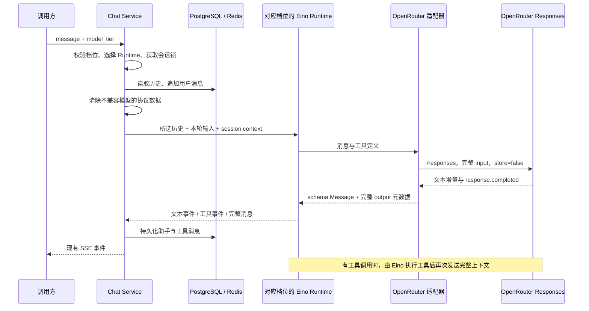

# OpenRouter Responses 接入与三档模型说明

本文说明当前代码如何接入 OpenRouter、如何复用 lite/pro/max 三档模型，以及会话历史、工具调用和缓存如何协作。实现与官方接口约束核对日期：2026-09-14。

## 1. 接入结果与设计选择

当前使用 Eino DeepAgent，通过独立的 OpenRouter 模型适配器调用 **Responses API**。应用保留原来的 HTTP/SSE 接口、MCP 工具执行器、会话锁、PostgreSQL 和 Redis 存储。

模型配置仍是 `LITE_MODEL`、`PRO_MODEL`、`MAX_MODEL`，`MODEL_PROVIDER` 决定三个档位共同使用的适配器；每个已配置档位拥有独立 Runtime。

OpenRouter 官方将 Responses 接口定义为无状态接口：请求必须包含所需历史；`store=true` 或非空 `previous_response_id` 会被拒绝。因此 OpenRouter 路径固定 `store=false`，每次发送本地装配的上下文，依靠上游 Prompt Caching 复用前缀计算。[官方 Responses 说明](https://openrouter.ai/docs/api_reference/responses/overview)

这里的“完整上下文”指本地历史窗口和工具配对检查后选中的消息，不表示数据库里整个会话的所有消息。

| 项目 | Ark 路径 | OpenRouter 路径 |
| --- | --- | --- |
| 模型工厂 | `arkmodel.NewFromEnv` | `openroutermodel.NewFromEnv` |
| 协议 | Ark Responses API | OpenRouter Responses API |
| 模型配置 | 三档变量 | 同样使用三档变量 |
| 服务端状态 | 使用 Ark SessionCache | `store=false` |
| 响应 ID | SDK 可用它裁剪历史并续接 | 用于当前消息和日志追踪，不作为续接参数 |
| 请求历史 | 有有效缓存时由 SDK 转成增量 | 发送所选的全部上下文 |
| 缓存 | 原有显式响应缓存，TTL 600 秒 | 上游自动前缀缓存，无本地统一 TTL |
| 工具定义 | 由 Ark SDK 处理 | 每次调用均携带本次绑定工具 |

## 2. 环境变量与启动

### 2.1 配置表

| 变量 | 要求 | 作用 |
| --- | --- | --- |
| `MODEL_PROVIDER` | 可选，默认 `ark` | 只接受 `ark` 或 `openrouter`；三个档位共享 |
| `LITE_MODEL` | 必填 | 默认档位对应的模型 ID |
| `PRO_MODEL` | 可选 | 留空时 pro 不可用 |
| `MAX_MODEL` | 可选 | 留空时 max 不可用 |
| `OPENROUTER_API_KEY` | OpenRouter 模式必填 | OpenRouter 账户密钥，不是 OpenAI 官方或 Ark 密钥 |
| `OPENROUTER_BASE_URL` | 可选 | 默认 `https://openrouter.ai/api/v1` |
| `ARK_API_KEY` | Ark 模式必填 | 保留原有 Ark 鉴权 |
| `ARK_BASE_URL` / `ARK_BASE_URL_CN` | Ark 模式至少一项 | 优先读取前者 |

OpenRouter 模式的三档变量应填写 OpenRouter 接受的完整模型标识。三个档位可以指向不同模型，也可以指向同一个模型。当前没有按档位设置不同 API Key、Base URL 或供应商的配置。

### 2.2 配置示例

以下尖括号内容是占位符，部署时需替换；不是实际可调用模型：

```dotenv
MODEL_PROVIDER=openrouter
OPENROUTER_API_KEY=<your-openrouter-api-key>
OPENROUTER_BASE_URL=https://openrouter.ai/api/v1

LITE_MODEL=<provider/lite-model>
PRO_MODEL=<provider/pro-model>
MAX_MODEL=<provider/max-model>
```

只启用 lite 时，将 `PRO_MODEL`、`MAX_MODEL` 留空即可。

Base URL 不包含 `/responses`，由 SDK 拼接该端点。构造函数拒绝无主机名、非 HTTP(S)、内嵌用户名密码、查询参数、片段，以及以 `/responses` 结尾的地址。HTTP 用于本地测试也被允许；官方地址使用 HTTPS。

从 [.env.example](../.env.example) 配置其他依赖后，在项目根目录启动：

```bash
./local_run.sh 8080
```

本地脚本根据供应商检查相应凭据。生产部署应在部署环境设置同样的变量；修改供应商或模型后需要重启。

### 2.3 与其他集成的关系

OpenRouter 替换的是模型调用链。MCP、PostgreSQL、Redis、同济开放平台、知识库、Tavily 和 Cozeloop 继续按各自配置初始化。使用 OpenRouter 不会自动关闭 Viking 知识库；启用知识库仍需它的火山凭据和资源配置。

**启动成功不代表远端模型已经验证可用。** OpenRouter 模型工厂只校验本地配置并创建客户端，不发送探测请求。模型 ID 不存在、Key 无效、账户权限或余额不足等问题可能在第一次真实调用时才暴露。已配置档位的本地构造或 Runtime 初始化失败会中止服务初始化，并沿用资源清理路径。

## 3. 三档模型选择与并发隔离

前端仍调用原接口：

```http
POST /v1/sessions/:session_id/messages
Content-Type: application/json

{"message":"帮我查询课程安排","model_tier":"pro"}
```

| 输入 | 行为 |
| --- | --- |
| 不传 `model_tier` | 使用 lite |
| `lite`、`pro`、`max` | 使用已配置的对应 Runtime |
| 空字符串、null、非字符串、其他大小写或名称 | HTTP 400 |
| 合法档位但模型变量留空 | HTTP 503，不自动降级 |

档位校验在开启 SSE、写入用户消息之前完成。一次 run 内的模型迭代和工具调用固定使用同一 Runtime；下一轮可以重新选择，省略时依然回到 lite，不记忆上一轮选择。

`StreamSession` 使用局部 Service 副本选择 Runtime，通过 context 传递本轮模型信息及会话 ID，不修改共享 Service 的 Runtime。工具通过 Eino 的 `model.WithTools(...)` 请求选项传入，模型实例不保存工具状态。HTTP 的 `session_id` 放在每次请求体里，不写入共享客户端 Header。

源码入口：[model_tier.go](../internal/application/chat/model_tier.go)、[service.go](../internal/application/chat/service.go)、[模型工厂](../internal/integration/modelprovider/model.go)。

## 4. 调用架构



主要文件与职责：

| 文件 | 职责 |
| --- | --- |
| [modelprovider/model.go](../internal/integration/modelprovider/model.go) | 根据共享供应商配置选择模型工厂 |
| [openroutermodel/model.go](../internal/integration/openroutermodel/model.go) | 唯一公开工厂 `NewFromEnv`，返回 `model.BaseChatModel` |
| [openroutermodel/types.go](../internal/integration/openroutermodel/types.go) | 按范围分组的全部私有类型：模型、配置、协议、推理、流事件和 SDK 传输 |
| [openroutermodel/adapter.go](../internal/integration/openroutermodel/adapter.go) | 私有模型实现、配置校验和 Generate 汇总 |
| [openroutermodel/sdk.go](../internal/integration/openroutermodel/sdk.go) | 官方 SDK 调用、原始协议保留、错误脱敏 |
| [openroutermodel/protocol.go](../internal/integration/openroutermodel/protocol.go) | 消息和工具转换、输出重放、用量映射 |
| [openroutermodel/stream.go](../internal/integration/openroutermodel/stream.go) | SDK EventStream 消费、完成检查、文本去重 |
| [modelmeta/meta.go](../internal/agentic/modelmeta/meta.go) | 协议 Extra 字段约定、会话 context |
| [runtime.go](../internal/agentic/runtime/runtime.go) | 识别无状态能力、运行 Agent、汇总输出 |
| [assembler.go](../internal/agentic/session/context/assembler.go) | 动态提醒位置、协议数据恢复、Ark 分支隔离 |
| [history.go](../internal/agentic/session/context/history.go) | 不完整历史工具链处理 |

适配器实现 Eino `model.BaseChatModel`，通过请求选项接收工具定义，使用官方 `github.com/OpenRouterTeam/go-sdk v0.7.132` 的 `Responses.Send` 和公开的 `types/stream.EventStream`，继续由 Eino 管理 Agent 循环。构建要求为 Go **1.25.10 或更高版本**，Docker 构建镜像同步固定为 1.25.10。SDK 为 beta，升级版本前必须运行协议回归测试。

SDK 接管 URL 构造、鉴权、请求序列化、HTTP 调用和 SSE 分帧，项目删除了自行逐行解析 SSE 的代码。`LITE_MODEL`、`PRO_MODEL`、`MAX_MODEL`、共享 Key/Base URL、`store=false`、完整历史和缓存统计保持原有行为。SDK 默认 `service_tier` 的序列化存在兼容限制，适配器显式设置 `auto`；它与业务的 lite/pro/max 档位无关。

`openroutermodel` 与 `arkmodel` 对外采用相同的 `NewFromEnv(ctx, modelID, effort) (model.BaseChatModel, error)` 工厂。构造函数和具体模型实现仍为包内私有；全部类型集中在同包的 `openroutermodel/types.go`，通过分组注释区分用途，上层继续通过工厂调用，不依赖这些内部数据类型。

`Generate` 和 `Stream` 共用一条流式 Responses 调用链：请求始终 `stream=true`，`Generate` 读取至完成并汇总为一个 Eino 消息。完成校验、工具提取、推理去重、缓存统计及原始 output 保存只实现一次。失败或断流时，`Generate` 返回错误，不将部分输出作为成功结果。

请求选项和工具定义直接构造 SDK 类型，删除 map → JSON → SDK 请求对象的往返转换。为保证不透明历史的完整性，仅保留每次请求独立的 `protocolClient`，通过 SDK `WithClient` 注入原始 `input`；它不缓存响应正文。这个例外避免 SDK 丢弃 reasoning 等已知对象的供应商扩展字段。

流式响应使用 SDK 公开的泛型 EventStream 和自定义事件解码器，保留完成对象中的原始 output；不使用会丢弃未知字段的类型化事件转换。非流式 HTTP 响应不再另设兼容分支，也不忽略 SDK 的解码错误。

评估过的现成 Eino OpenRouter 组件使用 Chat Completions，不能满足本项目的 Responses 约束；`agenticopenai` Responses 组件面向 `AgenticModel` 接口，不能直接替换现有 `BaseChatModel` 调用链。因此保留这一私有适配器，而不扩大到整个 Agent 架构迁移。参考：[Eino OpenRouter 实现](https://github.com/cloudwego/eino-ext/blob/main/components/model/openrouter/chatmodel.go)、[Eino Agentic OpenAI 组件](https://github.com/cloudwego/eino-ext/blob/main/components/model/agenticopenai/README.md)。

HTTP 超时仍由注入的 HTTP Client 控制，默认 2 分钟；未设置 SDK operation timeout，避免它在返回流对象时提前取消请求。SDK 自动重试显式关闭，保持每次模型调用一次请求的行为。HTTP 错误只暴露状态码，其他 SDK 错误不透出可能包含提示词的正文；context 取消仍可通过 `errors.Is` 判断。

参考：[官方 Go SDK](https://github.com/OpenRouterTeam/go-sdk)。

## 5. Responses 请求与工具映射

### 5.1 请求字段

下面是结构示例，`input` 和 `tools` 的实际值由运行时生成：

```json
{
  "model": "<selected-tier-model>",
  "session_id": "<application-session-id>",
  "store": false,
  "stream": true,
  "include": ["reasoning.encrypted_content"],
  "reasoning": {"summary": "auto", "effort": "low"},
  "input": [
    {"role": "system", "content": "固定指令"},
    {"role": "user", "content": "本轮输入"}
  ],
  "tools": []
}
```

`Generate` 与 Agent 主链的 `Stream` 均请求 `stream=true`；前者在包内汇总完整结果，后者直接返回增量流。没有工具时发送空的 `tools` 列表。直接调用模型而未绑定 session context 时省略 `session_id`；正常会话入口会传入它。

现有 Eino 调用选项可映射 `temperature`、`top_p`、`max_output_tokens` 和工具选择模式。默认请求 `reasoning.summary=auto` 获取上游可见摘要，继续保留 `include: ["reasoning.encrypted_content"]` 供跨轮重放；推理 effort 在模型工厂按档位固定为 LITE=`low`、PRO=`medium`、MAX=`high`，Ark 和 OpenRouter 一致，无对应环境变量。通过调用选项覆盖成另一模型会被拒绝，模型选择必须经过 tier 路由。

模型档位通过显式参数传入 `modelprovider.NewFromEnv(ctx, modelID, tier)`，不通过模型 ID 反查档位；因此三档即使配置相同模型 ID，仍分别发送 low/medium/high。目标模型若不支持对应 effort，由上游返回错误，不静默降级。

### 5.2 工具协议

工具按原始名称排序，参数 Schema 转为标准 JSON map 后序列化，使请求顺序更稳定。参数为空时发送空对象 Schema；当前设置 `strict=false`。

满足 `[a-zA-Z0-9_-]{1,64}` 的工具名原样发送。其他名称，包括带点号的 MCP 名称，转换成 `tool_` 加原名称 SHA-256 前 24 字节的十六进制表示。每次请求同时建立反向表，将模型返回的名字还原为 Eino/MCP 使用的原始名称。

重复协议名称会报错。模型返回未绑定工具、缺少 call ID 或非法 JSON 参数时，不交给工具执行器执行。

| Eino 消息 | Responses 表达 |
| --- | --- |
| 普通 system/user/assistant 文本 | 对应 role 与 content |
| `ToolCalls` | `function_call`，含 `call_id`、协议 name、arguments |
| 工具结果 | `function_call_output`，使用相同 `call_id` |
| 来源匹配的助手协议输出 | 直接重放原始 output items，避免重复添加文本和工具调用 |

工具仍由本地 Eino/MCP 链路执行。当前适配器不启用 OpenRouter 服务端工具搜索、网页搜索等内置工具。

## 6. 流式输出与错误边界

`response.output_text.delta` 和 `response.refusal.delta` 实时转为助手文本。推理增量支持 `response.reasoning.delta`、`response.reasoning_text.delta` 和 `response.reasoning_summary_text.delta`，经 `ReasoningContent` 直接投影为 `assistant.reasoning` 的 `data.delta`；每个事件只携带新增文本，前端在当前轮按顺序追加，不再逐分片重发累计全文。非流式输出作为一个增量发送；持久化仍汇总完整 `reasoning_content`，恢复历史时按消息顺序合并同轮推理。前后端统一使用 `data.delta`，推理事件缺少字符串类型的 `delta` 时忽略。

同一 output item 如果同时出现正文和摘要增量，采用先到达的非空表示，避免重复展示。完成对象只补充该表示尚未发送的后缀；如果完成时没有可见内容，或返回不同摘要，保留已经收到的推理增量，不重复追加另一份文本。不同 output index 分别处理。

没有增量而只有完成对象时，优先展示 summary，兼容字符串数组和 `summary_text` 对象数组；摘要为空时回退到明确的可见 reasoning content。`encrypted_content` 不用于展示。模型不返回可见推理时保持空白，不生成占位推理。摘要配置本身也不保证每个模型都返回推理。参考 [OpenRouter 推理说明](https://openrouter.ai/docs/api_reference/responses/reasoning)。

工具参数增量不直接执行：等到 `response.completed` 后，适配器从完整输出提取工具调用、推理后缀和协议数据。

完成时校验最终文本是否以前面已发送的文本为前缀，只发送尚未输出的后缀。最终消息携带完整工具调用和 Extra，Runtime 通过 `schema.ConcatMessages` 汇总，沿用现有 SSE 文本、推理及工具事件。

以下情况会失败：

- HTTP 非 2xx；错误包含状态码，不回显上游响应正文。
- JSON/SSE 无法解析、网络读取失败或超时。
- `response.failed`、`response.incomplete`、`error` 事件。
- 流结束但没有 `response.completed`；仅收到 `[DONE]` 不代表成功。
- 完成对象状态不是 `completed`、有错误、没有文本或工具调用。
- 增量文本与完成文本冲突，或返回当前适配器不支持的 output item。

前端可能在失败前已看到部分文本，但 Runtime 不会将这次流当成成功完成的助手消息持久化。默认 HTTP Client 的单次请求超时为 2 分钟，包含响应体读取；不是整轮 run 的总超时。SSE 分帧及单事件大小限制由固定版本 SDK 管理，不再使用自写的逐行扫描器。

适配器没有自动重试循环、自动 tier 降级或主动切换模型。OpenRouter 自身的上游路由行为与本地重试是不同层面。

## 7. 历史保存、恢复与模型切换

### 7.1 为什么保存协议数据

普通 `Content`、`ToolCalls`、`ReasoningContent` 用于应用展示和通用历史；它们无法完整表达不透明 reasoning items 等 Responses 输出。适配器额外保存整个 `output` 数组，来源封装为：

```json
{
  "version": 1,
  "endpoint": "https://openrouter.ai/api/v1",
  "model": "<selected-tier-model>",
  "output": []
}
```

封装 JSON 字符串放在 `schema.Message.Extra["model-protocol-data"]`，转换为 canonical 消息时写入 `ProtocolData`。`openrouter-response-id` 和 `openrouter-usage` 也存在于当次 Eino 消息 Extra，但当前持久化转换没有通用保存所有 Extra；不要把它们当作已入库的审计字段。

### 7.2 存储落点

| 存储 | 实现 |
| --- | --- |
| PostgreSQL | `agent_session_messages.protocol_data`，类型 TEXT，默认空字符串 |
| Redis | 追加 Lua 脚本把 `protocol_data` 写入消息 JSON，读取时专门解码 |
| 前端历史 JSON | `Message.ProtocolData` 标记为 `json:"-"`，不对外序列化 |

PostgreSQL 启动迁移执行：

```sql
ALTER TABLE agent_session_messages
ADD COLUMN IF NOT EXISTS protocol_data TEXT NOT NULL DEFAULT '';
```

旧记录保持空值并通过普通历史重建。Redis 旧消息没有该字段也能读取。协议数据与对应会话共享存储生命周期，没有独立的“缓存 TTL”；它保存的是可重放消息，不是上游 KV 缓存。

源码：[session.go](../internal/agentic/session/session.go)、[PostgreSQL 存储](../internal/agentic/session/store/postgres/store.go)、[Redis 存储](../internal/agentic/session/store/redis/store.go)。

### 7.3 切换规则

`sanitizeHistoryForModel` 找到最后一条模型 ID 与当前模型不一致的消息，清除该位置及之前的 `ProtocolData`、Ark `ResponseID` 和缓存到期时间。只保留连续同模型后缀中的协议元数据。处理的是内存副本，不删除数据库中的原始历史。

例如 lite=A、pro=B：

```text
A → A：连续 A 的协议输出可以恢复。
A → B：保留普通历史，不把 A 的不透明数据传给 B。
A → B → A：不会重新启用第一段 A 的协议数据。
```

两个档位如果指向同一模型 ID，不因 tier 名称变化而清除协议数据。重放之前，OpenRouter 适配器还检查版本、Base URL、模型 ID 和非空 output；来源不匹配则回退为普通消息。协议 JSON 本身损坏则报错。

这些检查不包含 OpenRouter 实际上游供应商标识、工具集合版本或账户标识。更换上游或工具配置后，对不透明推理数据的兼容性仍需真实联调。

### 7.4 历史窗口的实际行为

应用继续使用 `SESSION_HISTORY_MAX_MESSAGES` 等现有配置，服务缺省历史读取上限为 20 条；匿名会话还受到 Redis 消息保留上限约束。

OpenRouter 分支通过 `completeToolHistory` 检查工具配对：跳过孤立工具结果；若工具链在历史末尾仍未完成，或未完成时出现新的非工具消息，仅移除该调用及其部分结果。此前有效对话、用户原始问题和之后的新消息仍会保留，完整工具链及其协议数据不受影响。清理只作用于内存副本，不修改存储历史，也不会从数据库自动补取缺失配对消息。

## 8. 缓存如何生效与如何观测

### 8.1 三种状态不要混淆

- 本地 PostgreSQL/Redis 历史：负责恢复对话。
- Responses 服务端续接状态：本接入不使用。
- 上游 Prompt Caching：复用相同前缀的模型计算，是否命中由上游决定。

OpenRouter 对支持的模型提供自动或显式 Prompt Caching；本实现使用自动缓存路径，没有发送 `cache_control`、`prompt_cache_options` 或显式断点。要求显式开启的模型不能仅凭当前适配保证缓存生效。[官方缓存说明](https://openrouter.ai/docs/guides/best-practices/prompt-caching)

### 8.2 已落地的缓存友好处理

1. 使用稳定会话 ID，跨 run 和本轮工具迭代保持不变；不使用每轮变化的 run ID。
2. 稳定工具定义和参数序列化顺序。
3. 将动态 reminder 放在历史之后，减少动态内容对前面历史的干扰。
4. 同模型重放完整 output items，减少助手输出重建造成的差异。

OpenRouter 的 `session_id` 用于粘性路由，尽量复用同一上游；它不是缓存命中凭据，也不保证请求一定到达同一缓存实例。[会话粘性路由](https://openrouter.ai/docs/guides/best-practices/prompt-caching#provider-sticky-routing)

### 8.3 为什么仍可能命中不足

当前没有保存每轮动态 reminder 快照；历史用户内容与本轮包装后的输入也未统一成同一份可重放 input。移动 reminder 到末尾只是局部改善，跨 run 仍可能重建出不同前缀。

此外，历史窗口滑动、工具定义变化、模型切换、上游路由变化、未达到目标模型缓存门槛或缓存过期都会影响复用。当前不配置统一 TTL，也不承诺缓存折扣比例。全量上传上下文仍有网络和序列化成本，缓存主要减少上游重复计算。

### 8.4 用量字段

当完成对象包含 usage 时，适配器记录一条日志：

```text
OpenRouter model=<model> response=<id> usage=<json>
```

其中包含输入、输出、总 token，以及 `input_tokens_details.cached_tokens`、`cache_write_tokens`。缺失的两个细分值保留为指针空值，日志序列化为 null；整个 usage 缺失时不会生成这条用量日志。

Eino `ResponseMeta.Usage` 也获得 token 数和缓存读取数，但它的缓存字段是整数，缺失值会表现为零。因此判断“未知”与“确实为零”时，应以 OpenRouter usage 日志/原始 Extra 为准。

`cached_tokens > 0` 表示该次请求有缓存读取；可计算 `cached_tokens / input_tokens` 观察 token 命中比例。当前日志没有实际路由上游、缓存费用、首 token 延迟或独立缓存统计面板。

## 9. 部署、验证与回退

### 9.1 部署步骤

1. 配置 `MODEL_PROVIDER=openrouter`、Key 和三档模型标识，确认本地存储及其他依赖配置完整。
2. 部署代码并重启，确认 PostgreSQL 补列成功，已配置档位的 Runtime 初始化成功。
3. 创建测试会话，分别调用 lite/pro/max；保留未配置档位时验证 503 行为。
4. 用测试数据执行至少一次工具查询，检查工具开始、结果和最终回答。
5. 同一会话执行 lite → lite → pro → max → lite，确认模型选择和上下文连贯性。
6. 使用达到目标模型缓存长度要求的合成输入连续调用，对比 usage，而不是用 HTTP 成功状态代替缓存验证。

健康检查 `GET /v1/ping` 只能证明服务入口可用，不能证明模型权限、工具效果或缓存命中。

### 9.2 离线验证

在项目根目录执行：

```bash
go test ./...
go test -race ./internal/integration/openroutermodel ./internal/integration/modelprovider ./internal/application/chat ./internal/agentic/session/...
go vet ./...
bash -n local_run.sh
git diff --check
```

接入实现完成时，上述检查均已通过。测试使用合成输入、本地 HTTP Server、存储替身或 miniredis，不访问真实模型和学生数据。本次文档编辑未重复运行 Go 测试。

| 测试 | 覆盖内容 |
| --- | --- |
| [openroutermodel/model_test.go](../internal/integration/openroutermodel/model_test.go) | 请求路径、鉴权、无状态字段、工具与推理往返、SSE 去重、断流、错误、并发会话隔离 |
| [openroutermodel/sdk_test.go](../internal/integration/openroutermodel/sdk_test.go) | 真实 SDK 离线契约：未知字段重放、摘要变体、参数透传、Generate 断流拒绝、错误脱敏、取消与无隐式重试 |
| [openroutermodel/reasoning_test.go](../internal/integration/openroutermodel/reasoning_test.go) | 摘要请求、不同推理事件、完成后缀去重、空摘要和加密字段隔离 |
| [runtime/reasoning_test.go](../internal/agentic/runtime/reasoning_test.go) | 实时推理事件、非流式兼容、汇总与持久化不重复 |
| [modelprovider/model_test.go](../internal/integration/modelprovider/model_test.go) | 缺省 Ark、供应商选择及错误配置 |
| [chat/openrouter_test.go](../internal/application/chat/openrouter_test.go) | 真实 Runtime 下三档请求、连续同模型恢复、切换隔离、内部字段不外露 |
| [context/history_test.go](../internal/agentic/session/context/history_test.go) | 无状态 reminder 位置、Ark 字段隔离、工具配对 |
| PostgreSQL / Redis 存储测试 | 协议字段写入和恢复、旧有会话逻辑回归 |

### 9.3 尚未验证

真实 OpenRouter Key、目标模型、上游 reasoning 数据重放、工具执行和真实缓存命中尚未完成线上联调；生产数据库补列也未在本轮操作中执行。离线用例中的 cached token 是 fixture，用于验证解析，不是实际节省费用的证据。

### 9.4 回退至 Ark

设置 `MODEL_PROVIDER=ark`，恢复 Ark 凭据、地址和三档 Ark 模型 ID，重启服务。不要把 OpenRouter 的 `provider/model` 标识直接作为 Ark 模型 ID 使用。

新增数据库列可保留，无需为了回退删除它。Ark assembler 不恢复 OpenRouter 协议数据。模型 ID 改变后，历史按现有规则重建；切换部署过程中若旧版本实例仍写入消息，这些消息可能没有协议字段并降低后续重放完整性。

## 10. 排错与后续优化

| 现象 | 检查方向 |
| --- | --- |
| 启动缺少模型或 Key | `LITE_MODEL`、`MODEL_PROVIDER`、对应供应商密钥 |
| Base URL 校验失败 | 去掉 `/responses`、查询参数、内嵌凭据；使用 API 根地址 |
| pro/max 返回 503 | 是否配置对应变量并重启 |
| HTTP 401 | OpenRouter 密钥与账户授权 |
| HTTP 429 | 账户限流及上游容量；本地不会自动重试 |
| HTTP 400 或输出类型不支持 | 模型能力、请求选项、第三方端点的 Responses 完整兼容性 |
| 流结束报错 | 是否收到 `response.completed`，是否被代理截断或超过超时 |
| 工具调用无效或未绑定 | 工具白名单、名称映射、返回参数 JSON 与 call ID |
| 跨轮遗忘上下文 | 历史窗口、Redis 保留数量、是否触发不完整工具链清理 |
| 缓存字段为零或未知 | 目标模型缓存能力、输入门槛、前缀变化、路由、实际 usage |
| `invalid model protocol history` | 服务端协议 JSON 是否损坏；不要仅更改 response ID 绕过 |

后续优化可以依次推进，但当前尚未实现：

1. 保存实际发送的每轮 input/reminder 快照，统一用户消息包装，减少重建前缀差异。
2. 按 token 预算管理历史，补齐完整工具组，减少一次异常工具链导致大段历史丢失。
3. 按目标模型能力配置显式缓存断点及生命周期。
4. 记录实际路由上游、首 token 延迟、缓存费用和命中率，完成受控线上对照测试。
5. 扩展多模态、服务端工具或其他 Responses output 类型前，分别补齐协议映射和回归测试。

本实现目前支持文本、拒绝文本、函数工具与推理摘要/不透明数据保存；不支持多模态输入、deferred tools、服务端工具搜索或 stop 参数。API 返回的其他 output item 会明确报错，不能把 OpenRouter 平台支持的所有能力视为本适配器都已支持。
