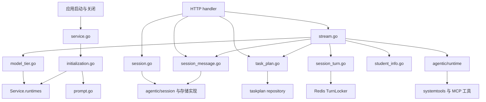
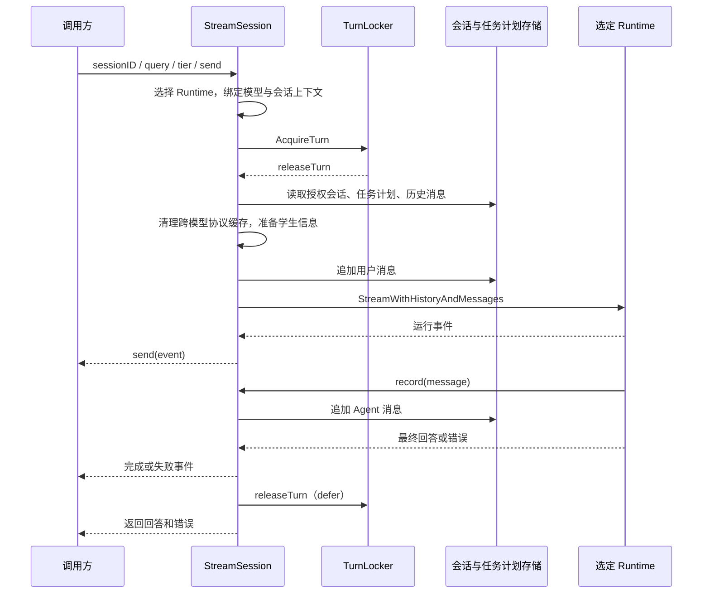

# Chat 应用服务

本目录是聊天功能的应用编排层：将请求身份、会话存储、任务计划、模型运行时和外部能力组合成一次完整的聊天操作。包名为 `chat`，对外提供 `Service` 实例方法及默认服务的包级入口。

## 架构与职责边界



各层的分工如下：

| 层级 | 职责 |
| --- | --- |
| `biz/handler` | HTTP 参数处理、响应状态、事件序列化与 SSE 写入；调用本包完成业务操作。 |
| 本目录 `application/chat` | 选择模型和存储、校验会话访问范围、协调消息写入与执行顺序、发送运行状态事件、管理启动资源。 |
| `agentic/runtime` | 执行 Agent，处理模型、工具与历史上下文，回调输出事件和待持久化消息。 |
| `agentic/session` | 定义会话、消息、存储与执行锁接口；PostgreSQL、Redis 实现负责实际存取。 |
| `agentic/session/taskplan` | 定义任务计划作用域和仓储，提供计划读取及工具使用的更新能力。 |
| `integration` | 封装模型供应商、MCP、知识库、网页抓取、同济开放平台等外部系统。 |

本包通过 `send func(agentevent.Event)` 输出事件，不直接操作 HTTP writer。会话身份来自 `platform/auth` 写入的请求上下文；本包根据身份选择访问路径，具体持久会话的所有权检查由存储接口完成。

## 文件组织

所有生产类型集中在 `types.go`。同一业务的包级入口和 `Service` 方法放在同一个业务文件中；测试辅助类型留在测试文件内。

| 文件 | 内容与主要入口 |
| --- | --- |
| `service.go` | 默认实例 `defaultService`；`Init`、`NewFromEnv`、包级 `Close` 和 `Service.Close`。只负责服务生命周期。 |
| `types.go` | `Service`、`sessionRuntime`、`initializationDeps`、`modelRuntime`、模型选择上下文类型。 |
| `initialization.go` | 默认依赖工厂 `defaultInitializationDeps`；`initializationDeps.initialize` 组装服务，并管理初始化失败时的资源清理。 |
| `session.go` | 会话创建、带名称创建、列表、重命名、删除。 |
| `session_message.go` | 消息快照分页、历史读取、用户消息追加闭包、Agent 消息持久化及历史窗口。 |
| `session_turn.go` | 获取会话执行锁；删除前等待当前轮次结束。 |
| `stream.go` | `StreamSession` 编排一次聊天；`stream` 调用选定运行时；统一发送运行状态和失败事件。 |
| `model_tier.go` | 档位校验与选择、消息模型元数据、历史协议数据与响应缓存隔离。 |
| `task_plan.go` | `GetSessionTaskPlan`、授权会话到 `TaskPlanScope` 的转换、当前任务计划读取。 |
| `student_info.go` | 从请求 access token 加载并格式化学生基础信息。 |
| `prompt.go` | 按提示词允许列表从 Cozeloop PromptHub 加载 system instruction。 |
| `initialization_test.go` | 初始化失败清理、成功后的资源所有权、可选 Chromium、三档 Runtime 组装。 |
| `service_test.go` | 学生信息、失败事件、工具允许列表、提示词、聊天执行顺序、锁等待、Ark 响应缓存持久化。 |
| `model_tier_test.go` | 三档并发路由、默认档位、错误档位、模型元数据和历史缓存隔离。 |
| `openrouter_test.go` | 使用本机测试服务器验证 OpenRouter 多档调用、协议历史和内部协议字段不对外暴露。 |
| `README.md` | 本目录的职责、执行链路与维护说明。 |

## 服务入口与生命周期

使用默认服务时，应用在启动阶段调用 `Init(ctx)`，随后通过包级业务函数访问同一个实例，退出时调用包级 `Close()`。

需要独立实例时，调用 `NewFromEnv(ctx)`，通过返回的 `*Service` 执行业务，并由调用方负责 `Service.Close()`。`NewFromEnv` 不修改默认实例。

`NewFromEnv` 是环境构造入口，不再设置 `newFromEnv`。实际依赖装配集中在 `initializationDeps.initialize`，测试通过替换该结构中的工厂隔离外部系统，不使用可变全局测试钩子。

当前 `Init` 会直接替换默认实例，`Close` 不清空默认实例，也没有提供重复关闭的幂等保证。生命周期应由应用启动和退出流程统一管理；运行期间不应将 `Init` 当作热重载接口。

### 初始化顺序

1. 加载系统提示词、创建 Lite 模型、知识库客户端和 skill catalog。
2. 创建 Tavily 与网页抓取客户端，检查 Chromium。浏览器不可用时禁用浏览器提取、保留 HTTP 抓取；若上下文已取消，则终止初始化。
3. 连接远程 MCP，将工具允许列表转换为 Eino 工具。
4. 读取沙箱开关，仅在启用时创建文件系统中间件。
5. 读取会话配置，初始化 PostgreSQL 及 schema、Redis、任务计划仓储。
6. 组合系统工具和 MCP 工具，创建 Lite Runtime；按配置创建 Pro、Max Runtime，全部存入 `Service.runtimes`。各档共享已组装的工具和基础 Runtime 配置，使用各自的模型。
7. 构造 `Service`，将连接清理责任移交给实例。

MCP 连接建立后，后续初始化失败会按 **Redis → PostgreSQL → MCP** 的顺序清理已经获得的资源。成功后 `Service.Close` 使用同一清理闭包；Redis 或 MCP 的关闭错误通过 `errors.Join` 汇总，不阻断其余资源释放。`Service.Close` 仅调用清理闭包；实例为 nil 或未设置闭包时直接返回 nil。测试手工构造的实例需自行安排资源清理。

## 对外业务能力

下表中的业务函数同时提供包级形式和 `Service` 方法；`ValidateModelTier` 仅提供面向默认实例的包级入口。

| 入口 | 行为 |
| --- | --- |
| `CreateSession(ctx, name)` | 持久存储支持 `NamedSessionCreator` 时带名称创建，否则退回普通创建；匿名路径使用普通创建。 |
| `ListSessions(ctx)` | 列出当前已认证用户的持久会话。 |
| `RenameSession(ctx, sessionID, name)` | 修改当前已认证用户拥有的持久会话名称。 |
| `DeleteSession(ctx, sessionID)` | 等待会话执行锁后，删除当前已认证用户拥有的持久会话。 |
| `ListSessionMessages(ctx, sessionID, limit, offset, snapshotSequence)` | 将快照分页参数转交对应存储的分页接口。 |
| `GetSessionTaskPlan(ctx, sessionID)` | 读取可访问会话，再在其作用域中获取任务计划。 |
| `StreamSession(ctx, sessionID, query, send, tier)` | 执行一轮聊天，回调事件并返回最终回答和错误；必须传入单个合法档位；HTTP 层在请求未指定档位时填入 `lite`，Service 层不提供默认值。 |
| `ValidateModelTier(tier)` | 校验档位名称及默认服务是否已配置对应 Runtime。 |

### 会话与身份

| 请求上下文 | 存储选择 | 访问方式 |
| --- | --- | --- |
| 存在 `UserID` | `durableSessionStore`，默认 PostgreSQL | 读取、写入及管理操作携带 `ownerUserID`。 |
| 不存在 `UserID` | `ephemeralSessionStore`，默认 Redis | 按匿名 `sessionID` 读取和写入，生命周期由匿名配置控制。 |

列表、重命名和删除仅面向已认证用户的持久会话。创建、聊天、消息分页及任务计划读取均支持上述两条存储路径。列表、重命名、删除和分页通过对应的可选能力接口调用，存储不支持时返回错误。

`UserID` 决定存储路径，access token 决定是否加载学生基础信息，两者分别读取。缺少 token 时跳过加载；携带 token 但客户端缺失或加载失败时终止本轮模型调用。`Service` 在初始化时创建并复用一个同济 API 客户端，启动时校验 `TONGJI_OPEN_PLATFORM_*` 配置，不再在每轮请求中创建客户端。

## 一轮聊天的执行链路



执行时需要保持以下顺序：

1. 在获取执行锁和写入消息前校验模型档位。模型选择失败直接返回错误，不发出运行事件。
2. 持锁后读取会话，创建并绑定 `TaskPlanScope`，读取当前计划并写入上下文。
3. 读取历史，构造用户消息追加闭包；此时尚未写入用户消息。
4. 使用 `sanitizeHistoryForModel` 清理历史副本中的跨模型协议数据与缓存。
5. 进入 `stream`，发送开始和上下文准备事件，按需加载学生信息。
6. 调用追加闭包写入用户消息，再执行 Runtime；通过 `record` 回调逐条保存 Agent 输出，写入 `RunID`、模型档位、模型 ID 和响应缓存信息。
7. 转发 Runtime 事件，发送完成或失败事件，返回时释放执行锁。

这些步骤没有被包裹在一个跨模型调用的数据库事务中。用户消息追加成功后，若模型或后续消息写入失败，已经保存的消息不会由本层回滚。

### 并发与删除

流式执行调用 `acquireSessionTurn`，同一会话已有轮次时返回 `ErrTurnInProgress`。删除调用 `waitForSessionTurn`，遇到该错误每隔 10 ms 重试，直到取得锁或请求上下文取消。成功获取的锁均通过 `defer` 释放。

三档统一存储在 `runtimes map[string]modelRuntime`，每个条目包含运行时和模型 ID。每轮直接把选中的运行时传入 `stream`，不修改 `Service`，也不保存“当前运行时”字段。初始化完成后应将该映射视为只读，避免与并发请求发生写入竞争。

## 模型档位与历史隔离

| 档位 | 模型配置 | 初始化行为 |
| --- | --- | --- |
| `lite` | `LITE_MODEL` | 始终尝试创建，失败则服务初始化失败。 |
| `pro` | `PRO_MODEL` | 非空时创建，空时不注册。 |
| `max` | `MAX_MODEL` | 非空时创建，空时不注册。 |

`MODEL_PROVIDER` 由 `integration/modelprovider` 解析，当前支持默认的 `ark` 和 `openrouter`。凭据、供应商协议和模型具体配置由集成层管理。

`StreamSession` 必须传入单个档位参数；HTTP 层在请求未指定 `model_tier` 时填入 `lite`。传入空字符串、未知值或大小写不匹配的值会返回 `ErrInvalidModelTier`。合法但未配置的档位返回 `ErrModelTierUnavailable`，不会自动降档。

`sanitizeHistoryForModel` 保留历史消息内容，只清理当前模型连续后缀之前的 `ProtocolData`、`ResponseID`、`ResponseCacheExpiresAt`。判断依据是模型 ID；切换后再切回原模型，也不会复用中间切换点之前的协议缓存。清理在历史副本上执行，不修改存储中的消息。

## 上下文、配置与事件

系统提示词在初始化时由 `prompt.go` 加载；Cozeloop 未启用时返回空 instruction。Skill catalog 单独进入 Runtime 配置。知识库通过初始化注入 Runtime 和系统工具；`stream` 当前没有启用直接检索并拼接知识库结果的代码。

会话容量配置由 `agentic/session/config` 解析：

| 环境变量 | 默认值 | 用途 |
| --- | --- | --- |
| `SESSION_ANONYMOUS_TTL` | `24h` | 匿名会话 TTL，必须是正时长。 |
| `SESSION_ANONYMOUS_MAX_MESSAGES` | `20` | 匿名消息容量，必须是正整数。 |
| `SESSION_HISTORY_MAX_MESSAGES` | `100` | 本轮历史消息读取上限，必须是正整数。 |

`historyLimit` 对手工构造且未设置历史上限的实例也回退到 100。数据库连接、MCP、沙箱和各集成客户端的配置由对应包解析；部署参数以 Agent 仓根目录的 `.env.example` 和 `README.md` 为准。

本层通过统一 Emitter 发送 `RunStarted`、`AgentStatus`、`RunCompleted` 或 `RunFailed`，并转发 Runtime 事件。主要失败码如下：

| 失败码 | 含义 |
| --- | --- |
| `session_unavailable` | 会话、任务计划或历史准备失败。 |
| `turn_in_progress` | 会话执行锁冲突，或用户消息追加返回轮次冲突。 |
| `agent_unavailable` | 内部 `stream` 收到不可用服务或运行时。 |
| `student_info_unavailable` | 学生信息加载失败。 |
| `session_write_failed` | 模型执行前的用户消息追加失败。 |
| `agent_execution_failed` | Runtime 执行返回错误，包括其传播的消息记录错误。 |

`runFailedData` 保留业务错误码和文案，附带原始错误字符串 `Reason`，并从可识别的错误文本中提取 HTTP `StatusCode`。调用方仍需处理函数返回的错误；不能假定所有提前返回都会触发事件回调。

## 测试与维护

在 Agent 仓根目录执行：

```sh
go test ./internal/application/chat ./biz/handler
go test -race ./internal/application/chat ./biz/handler
```

初始化测试通过 `initializationDeps` 注入工厂，覆盖资源获取和释放的顺序。模型路由测试并发调用三档 Runtime，验证选择和消息元数据不会串档。OpenRouter 集成测试使用本机 HTTP 测试服务器，因此运行环境需要允许监听本机临时端口。

修改时按职责定位：

| 变更 | 修改位置 |
| --- | --- |
| 新增生产类型或依赖字段 | `types.go`；相应默认工厂和组装逻辑放入 `initialization.go`。 |
| 新增会话管理能力 | `session.go`，底层存储能力在 `agentic/session` 中定义和实现。 |
| 修改消息存取、分页或持久化元数据 | `session_message.go`。 |
| 修改聊天步骤、事件或错误映射 | `stream.go`。 |
| 修改档位、模型元数据或历史隔离 | `model_tier.go`，必要时同步初始化及供应商配置。 |
| 修改任务计划授权和读取流程 | `task_plan.go`；计划更新规则与工具实现在 taskplan 和 systemtools 层。 |
| 修改提示词或学生信息来源 | `prompt.go` 或 `student_info.go` 及对应集成包。 |

保持 `service.go` 只承载生命周期入口；业务入口与实例实现放在对应业务文件。调整初始化流程时同步检查失败清理；调整流式流程时同步检查消息写入顺序、锁释放、模型隔离和事件行为。
